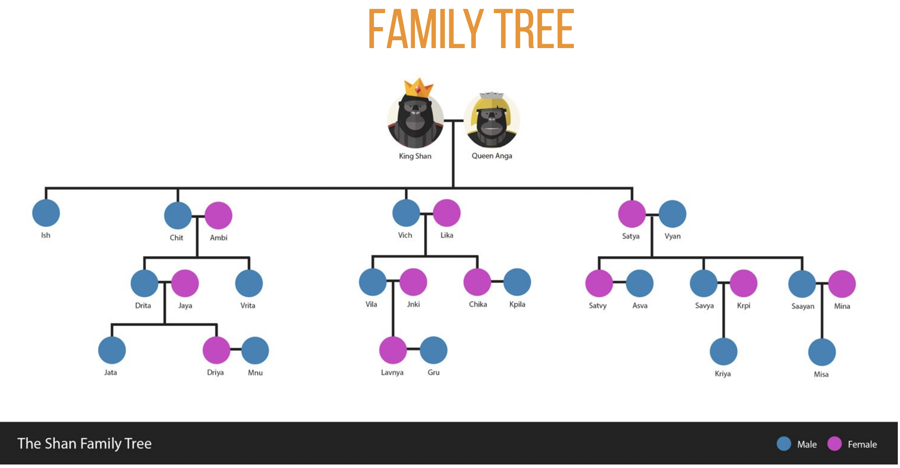

# Family Tree Engineering Test
In this project, the features on the web are written in React with Typescript.

### Note: This project is not created using `create-react-app`. Instead all the setup are done from scratch

## Technology
1. React with Typescript - Functional Components
2. [styled-component](https://styled-components.com/docs/basics#getting-started) for styling in this project
3. `Jest` and `React Testing Library` for unit test cases

## Build Tools
1. `Prettier` for formatting
2. `ESlint` for linting
3. `Parcel`
4. `Babel`

## Codebase Paradigm
1. `Error Boundary` to capture the errors in React
2. `Path alias` for easy importing 
3. `Workspace setting` to enable all the developers to have same workspace settings
4. Basic `Routing` using `BrowserRouter`
5. `Code splitting` - Though this project is not so big that it demands code splitting, it still has code splitting using `lazy` and `Suspense` provided by React

## Task
### Problem 4: Who's Your Daddy
Since the empire has been around for four generations, there are many folks in Lengaburu who do not know the relationship between the royalty.
Given two names as input, the output should be the relationship between the two.

Input: Person = Kriya 
Input: Relative = Saayan
Expected Output: Paternal Uncle




## How to run

### Open project 
```sh
Open project workspace (or) Open the folder family-tree 
npm i
```


### First install all dependencies
```sh
cd family-tree 
npm i
```

### To start the local server
```sh
npm run dev
(Opens the app in localhost:1234)
```


### To run prettier formatting
```sh
npm run format
```

### To run lint
```sh
npm run lint
```

### To run the unit test cases
```sh
npm run test
npm run test:watch (for watch mode)
```

## Project structure

You should see the project is structured as follows:

```
        src
        ├── __mocks__
        ├── components
        ├── pages
        ├── shared
        │   ├── assets
        │   |    ├── data
        │   |    ├── images
        │   ├── components
        │   ├── interfaces
        │   └── styles
        └── test
```

### src/__mocks__

A place that has fileMock.js file that exports mock data for images in unit testing


### src/components

A place that contains building blocks of a page

### src/pages

A place for all pages that has routes for it "backend routes".

### src/shared

This folder contains some of the shared components/styles/interfaces/assets across multiple apps.

### src/shared/assets

A place for all kinds of assets used in code such as images/data.
